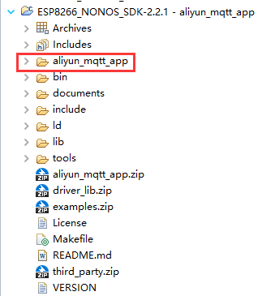
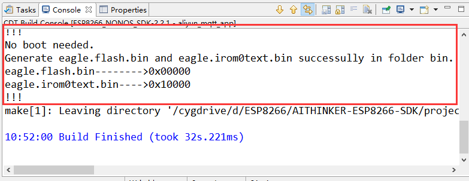
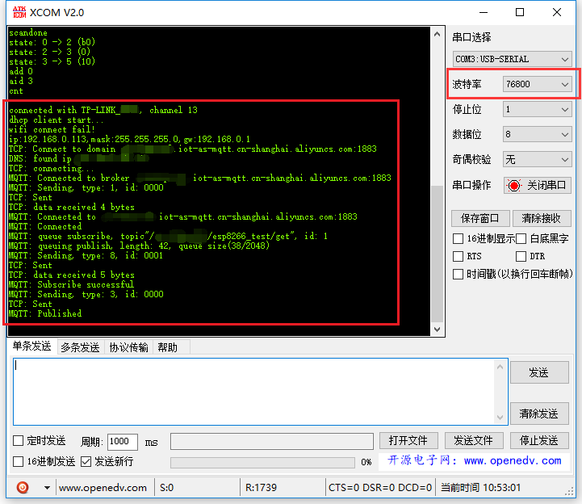
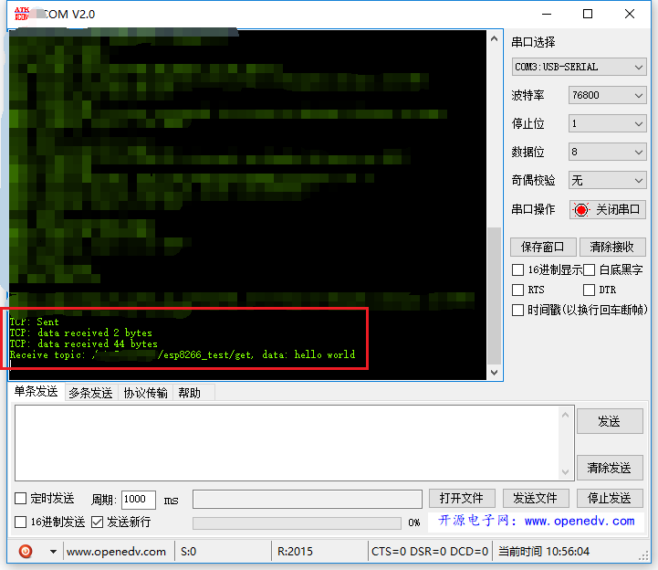

# esp8266_aliyun_mqtt_app

基于ESP8266官方SDK接入[阿里云物联网平台](https://www.aliyun.com/product/iot)，只需填入阿里云设备认证三元组即可快速接入。

相关博客：[使用ESP8266（基于官方SDK）接入阿里云物联网平台](https://blog.csdn.net/yannanxiu/article/details/81334230)


## 本人所用的环境

- Windows 10
- [安信可 ESP 系列一体化开发环境](http://wiki.ai-thinker.com/ai_ide_install)（基于 Windows + Cygwin + Eclipse + GCC 的综合 IDE 环境）
- ESP8266_NONOS_SDK-3.0.0
- NodeMCU（ESP8266 4MB flash）


## 使用步骤

1. 首先到乐鑫[官网](https://www.espressif.com/zh-hans/products/hardware/esp8266ex/resources)或[github](https://github.com/espressif/ESP8266_NONOS_SDK)下载ESP8266_NONOS_SDK；
2. 下载本仓库，然后拷贝`aliyun_mqtt_app`文件夹到SDK主目录，用法类似于`ESP8266_NONOS_SDK/examples`里面的工程；
3. 在ESP8266 IDE里导入整个SDK，如果不熟悉该环境，参考[这里](http://wiki.ai-thinker.com/ai_ide_use)；
4. 使用SDKv3.0.0还需要修改该SDK的顶层Makefile。编辑器打开该SDK的顶层Makefile，找到下面配置变量，修改`SPI_SIZE_MAP`为4（如果是使用32Mbit Flash）。

	```Makefile
	# ...
	# 25行
	BOOT?=none
	APP?=0
	SPI_SPEED?=40
	SPI_MODE?=QIO
	SPI_SIZE_MAP?=4
	```

	如果不修改，后面编译会报下面错误：

	```
	#error "The flash map is not supported"
	```

5. 最后编译下载即可（建议先clean）。




> 如果想试试用smartconfig配置Wi-Fi信息，可下载smartconfig分支。

## 配置信息

当在阿里云物联网平台获取到设备认证三元组后，编辑`app/include/user_config.h`文件，修改下面信息，然后编译下载并重启ESP8266，最后应该就能在控制台看到设备上线了。

> 注意，阿里云三元组的宏定义，从上到下分别是：产品key，设备name，设备secret。不要拷贝错了。

```C
#define PRODUCT_KEY     "PRODUCT_KEY"

#define DEVICE_NAME     "DEVICE_NAME"
#define DEVICE_SECRET   "DEVICE_SECRET"

#define WIFI_SSID       "WIFI_SSID"
#define WIFI_PASS       "WIFI_PASS"

```

当ESP8266IDE的Console打印出以下信息，则表示编译成功：

```
...
!!!
No boot needed.
Generate eagle.flash.bin and eagle.irom0text.bin successully in folder bin.
eagle.flash.bin-------->0x00000
eagle.irom0text.bin---->0x10000
!!!
```



## 烧写bin

这一步对新手来说可能坑比较多。可参考安信可的[烧写步骤](http://wiki.ai-thinker.com/esp_download#%E7%83%A7%E5%BD%95%E4%B8%8B%E8%BD%BD)，也可参考我[ESP8266-Demos](https://github.com/AngelLiang/ESP8266-Demos)仓库里[wiki](https://github.com/AngelLiang/ESP8266-Demos/wiki)的烧写说明（目前待完善）。

对老手来说，平时怎么烧写就怎么烧写。

## 主要模块说明

- `mqtt/`：mqtt主模块，从官方SDK中的`example/esp_mqtt_proj`项目移植过来的；
- `user/md5.c`：md5加密模块，生成阿里云mqtt password需要用到**hmacmd5**；
- `user/aliyun_mqtt.c`：生成阿里云mqtt信息的核心模块，主要包括`mqtt host`、`mqtt port`、`mqtt client id`、`mqtt username`以及动态生成的`mqtt password`；
- `user/user_smartconfig.c`：smartconfig模块（smartconfig分支才有），当定义了`SMARTCONFIG_ENABLE`可以以手机配网的方式给ESP8266连接Wi-Fi。


## 注意事项

- 关于串口波特率

    ESP8266串口打印默认为74880bps，如果串口工具没有74880bps也可以选择76800bps。

    或者修改下`user/user_main.c/user_init()`的代码：

    ```C
    // ...
    void user_init(void) {
	    //uart_init(BIT_RATE_74880, BIT_RATE_74880);
	    uart_init(BIT_RATE_115200, BIT_RATE_115200);
        //...
    }
    ```

- 关于源码文件中的中文乱码

    因为源码文件编码默认为UTF-8，而Windows Eclipse IDE默认为GBK，所以可能需要设置一下：

    菜单栏Window -> Preferences -> General -> Workspace -> 面板Text file encoding -> 选择UTF-8 -> OK


## 串口打印效果图

MQTT连接阿里云成功：



接收云端下发的命令`hello world`：



## 排错

首先要调试好ESP8266串口能正常打印出信息。一般来说，使用74880bps不会有乱码，使用115200bps，开头一小段会有乱码。

### wifi连接失败

如果wifi连接失败，会重复打印下面信息：

下面是表示找不到`WIFI_SSID`的wifi热点。

```
no WIFI_SSID found, reconnect after 1s
reconnect
wifi connect fail!
wifi connect fail!
wifi connect fail!
wifi connect fail!
wifi connect fail!
wifi connect fail!
scandone
no WIFI_SSID found, reconnect after 1s
reconnect
wifi connect fail!
wifi connect fail!
wifi connect fail!
wifi connect fail!
wifi connect fail!
scandone
no WIFI_SSID found, reconnect after 1s
wifi connect fail!
reconnect
wifi connect fail!
wifi connect fail!
wifi connect fail!
```

wifi密码错误及其他原因则不断打印「`wifi connect fail!`」信息，因为本人没有在代码层面上做更多的判断。

### MQTT连接阿里云失败

打印信息：

```
connected with TP-LINK, channel 13
dhcp client start...
wifi connect fail!
ip:192.168.0.113,mask:255.255.255.0,gw:192.168.0.1
TCP: Connect to domain PRODUCT_KEY.iot-as-mqtt.cn-shanghai.aliyuncs.com:1883
DNS: found ip ******
TCP: connecting...
MQTT: Connected to broker PRODUCT_KEY.iot-as-mqtt.cn-shanghai.aliyuncs.com:1883
MQTT: Sending, type: 1, id: 0000
TCP: Sent
TCP: data received 4 bytes
MQTT: Connected to PRODUCT_KEY.iot-as-mqtt.cn-shanghai.aliyuncs.com:1883
MQTT: Connected
MQTT: queue subscribe, topic"/PRODUCT_KEY/DEVICE_NAME/get", id: 1
MQTT: queuing publish, length: 41, queue size(37/2048)
TCP: Disconnected callback
MQTT: Disconnected
```

可以看到末尾有TCP/MQTT断开了连接的信息：

```
...
TCP: Disconnected callback
MQTT: Disconnected
```

## 其他补充

- 如果想要学习使用ESP8266官方的mqtt sample app（esp_mqtt_proj），可以参考我这篇[博客](https://blog.csdn.net/yannanxiu/article/details/53088534)
- 安信可IDE开发环境资料：
  - 如何安装安信可一体化开发环境：http://wiki.ai-thinker.com/ai_ide_install
  - 如何使用安信可 ESP 系列一体化开发环境：http://wiki.ai-thinker.com/ai_ide_use
  - 如何为 ESP 系列模组烧录固件：http://wiki.ai-thinker.com/esp_download
